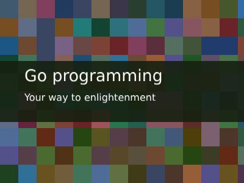
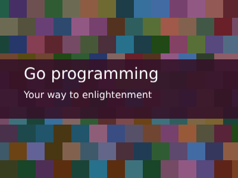
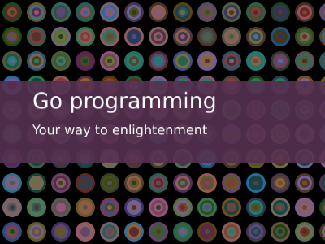
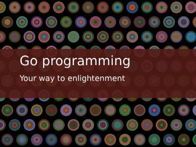
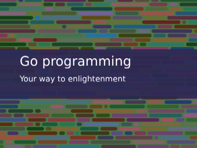
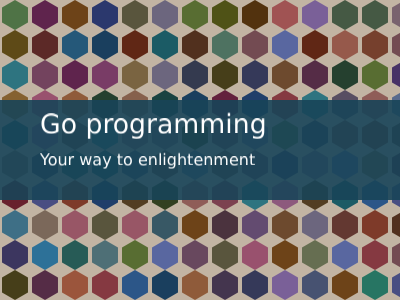

Generates a banner of given sizes with main and support text as .png. 

Usage:
```bash

Usage of ./banner:
  -alg int
    	Background painter algorithm; valid values are: 
    	0 -> random rectangles
    	1 -> random rectangles with offset
    	2 -> plain color
    	3 -> concentric circles
    	4 -> concentric circles offset
    	5 -> random horizontal lines
    	6 -> random hexagons
    	7 -> random hexagons with offset
    	 (default 5)
  -height int
    	height of the resulting image (default 600)
  -outName string
    	name of output file where banner in .png format will be saved (default "out.png")
  -subtext string
    	explanatory text to display in the image below the text (default "this time about really important things")
  -text string
    	text to display in the image (default "My blogpost")
  -ts float
    	size of tile (default 30)
  -width int
    	width of the resulting image (default 800)
```

Result is always saved to out.png in current working directory.

## Examples:

### Default 800x600 image:
`./banner`:


### Other examples:
`./banner -alg 0 -outName img/out_alg_0.png -width 400 -height 300 -text Go programming -subtext Your way to enlightenment `









