# Project
banner is a simple raster graphics generator that generates randomly a background and two lines of text.

## Warning
[banner](https://github.com/kamchy/banner) is my first Go repository cretaed for language learning and is not ready for production.

## Example
This is default image (when no commandline options are provided)
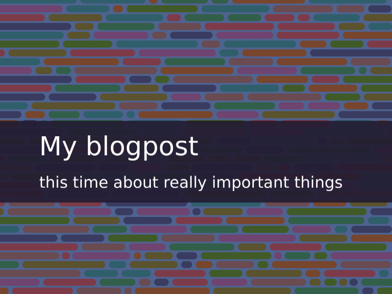

## Usage
The usage options are as follows:

```bash
Usage of input:
  -alg int
    	Background painter algorithm; valid values are: 
    	7 -> random hexagons with offset
    	0 -> random rectangles
    	1 -> random rectangles with offset
    	2 -> plain color
    	3 -> concentric circles
    	4 -> concentric circles offset
    	5 -> random horizontal lines
    	6 -> random hexagons
    	 (default 5)
  -h int
    	height of the resulting image (default 600)
  -o string
    	name of output file where banner in .png format will be saved (default "out.png")
  -p int
    	palette type; valid values are: 
    	0 -> Warm
    	1 -> Happy
    	2 -> Hue
    	
  -st string
    	explanatory text to display in the image below the text
  -t string
    	text to display in the image
  -ts float
    	size of tile (default 30)
  -w int
    	width of the resulting image (default 800)

```
## Readme generator
The project also contains readme generator binary (in cmd/readmegenerator/main.go)
which takes path to image directory where it generates images, and writes this file's
contents to stdout, with image linked to this markdown file.

For details, see [the source](https://github.com/kamchy/banner/blob/main/src/readmegenerator/main.go)
### Usage

```bash
cd /cmd/readmegenerator && go build .
cd ../..
./cmd/readmegenerator/readmegenerator ../..
```

## Images
And here are images:


### Image img/out_alg0_pal0.png


### Image img/out_alg0_pal1.png
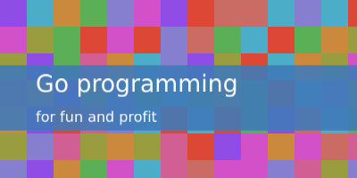

### Image img/out_alg0_pal2.png
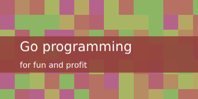

### Image img/out_alg1_pal0.png
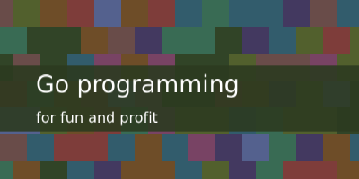

### Image img/out_alg1_pal1.png


### Image img/out_alg1_pal2.png
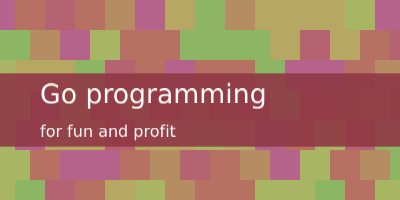

### Image img/out_alg2_pal0.png


### Image img/out_alg2_pal1.png


### Image img/out_alg2_pal2.png


### Image img/out_alg3_pal0.png
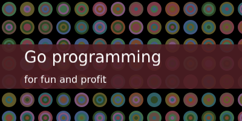

### Image img/out_alg3_pal1.png
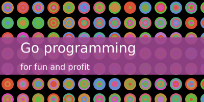

### Image img/out_alg3_pal2.png
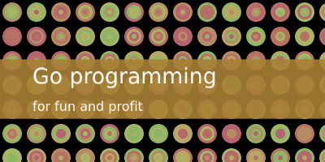

### Image img/out_alg4_pal0.png
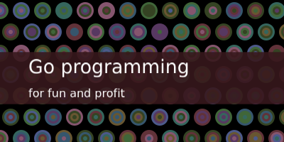

### Image img/out_alg4_pal1.png
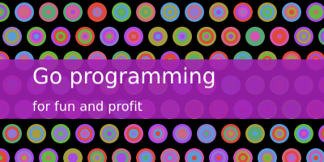

### Image img/out_alg4_pal2.png
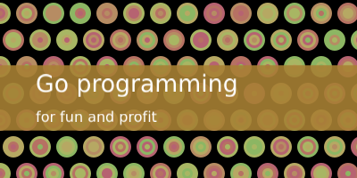

### Image img/out_alg5_pal0.png


### Image img/out_alg5_pal1.png
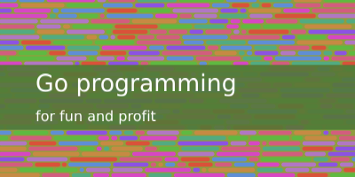

### Image img/out_alg5_pal2.png
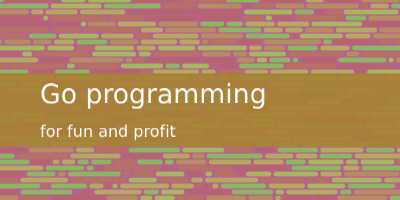

### Image img/out_alg6_pal0.png
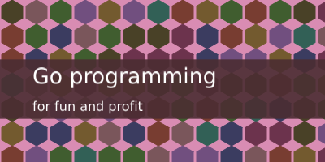

### Image img/out_alg6_pal1.png


### Image img/out_alg6_pal2.png
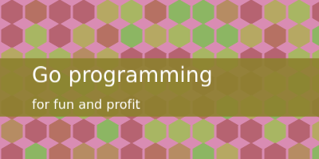

### Image img/out_alg7_pal0.png


### Image img/out_alg7_pal1.png
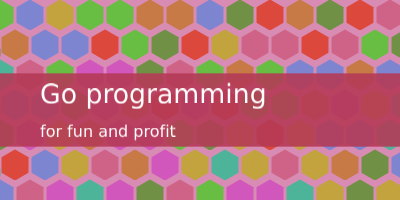

### Image img/out_alg7_pal2.png
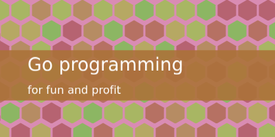

